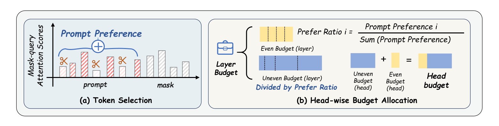

<div align="center">
<br>
<h3>MaskKV: Fine-Grained Cache Eviction for Efficient dLLM Inference</h3>
<p align="center">
  <a href="https://arxiv.org/abs/2510.09309">
    
  </a>
</p>
</div>

## Updates
- **(10/2025)** Initial release of **MaskKV** (official implementation).
- **Supported Models**: LLaDA-8B, Dream-7B.
- **Supported Methods**:
MaskKV, SnapKV, PyramidKV, SqueezeAttention, adaKV.
---

## To-Do List

Planned tasks and improvements for **MaskKV**:

- [ ] Refactor the codebase for better modularity and readability
- [ ] Release the official code

---

## Overview

**MaskKV** is a **training-free framework** that unlocks efficient long-context inference for **Diffusion Large Language Models (dLLMs)**. It drastically **slashes memory usage** and **accelerates performance**, all while preserving high accuracy.

While dLLMs offer powerful **parallel decoding**, they are bottlenecked by the **massive memory costs** of caching the entire sequence at every step. **MaskKV** tackles this challenge with a **fine-grained KV cache pruning** strategy that leverages signals unique to the diffusion process, moving beyond the limitations of heuristics designed for autoregressive models.

<p align="center">
  
</p>

---

## Core Techniques

### 🟩 Mask-Voting
- Leverages the attention patterns from **[MASK] tokens**, which act as strong indicators of token importance.
- Selectively retains **critical prompt tokens** in the KV cache.

### 🧩 Adaptive Budget Allocation
- **Hierarchically allocates cache budget** across layers and attention heads.
- Prioritizes:
  - **Boundary layers** (with the strongest contextual impact)
  - **High-Prompt-Preference heads** (most sensitive to prompt semantics)

---

## Key Results

Experiments on **LLaDA-8B** and **Dream-7B** show consistent gains in accuracy, efficiency, and memory usage.

| Metric | Result |
|:--|:--|
| **Accuracy** | Retains **94%** of full-cache performance on *LongBench* with only **256 KV pairs (<5% tokens)** |
| **Speed** | Achieves up to **31× faster decoding** at 32k prompt length |
| **Memory** | Reduces peak memory by **65%**, enabling **8× longer prompts** on a single GPU |

---

## Acknowledgement

This work is developed based on the open-source project **[dLLM-Cache](https://github.com/maomaocun/dLLM-Cache)**, which provides an adaptive caching framework for diffusion large language models.  
We also incorporate ideas and implementation details inspired by the following open-source projects:

- [AdaKV](https://github.com/FMInference/AdaKV)
- [DuoAttention](https://github.com/ContextualAI/DuoAttention)

Furthermore, our experiments leverage diffusion language models from:
- [Dream](https://github.com/DreamLM/Dream)
- [LLaDA](https://github.com/ML-GSAI/LLaDA)

We sincerely thank the authors of these works for their open-source contributions, which greatly facilitated the development of **MaskKV**.

## Citation
```
@article{huang2025maskkv,
  title={Mask Tokens as Prophet: Fine-Grained Cache Eviction for Efficient dLLM Inference},
  author={Huang, Jianuo and Zhang, Yaojie and Yang, Yicun and Huang, Benhao and Qi, Biqing and Liu, Dongrui and Zhang, Linfeng},
  journal={arXiv preprint arXiv:2510.09309},
  year={2025}
}
```

